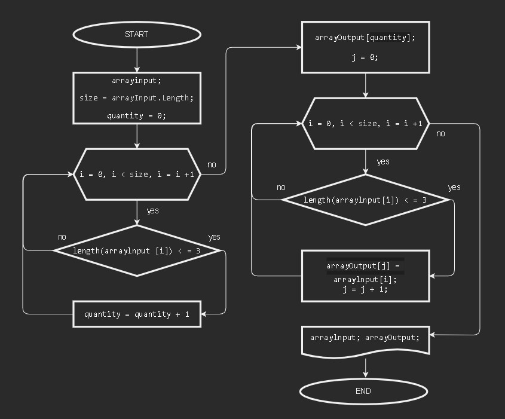

# Итоговая работа

## ЗАДАЧА:

Написать программу, которая из имеющегося массива строк формирует массив из строк, длина которых меньше либо равна 3 символа.

Первоначальный массив можно ввести с клавиатуры, либо задать на старте выполнения алгоритма. При решении не рекомендуется пользоваться коллекциями, лучше обойтись исключительно массивами.

**ПРИМЕРЫ**:

* ["hello”, "2", "world”,-> ["2"] 
* ["1234”, ”1567", ”-2”, "computer science"] -> ["-2"]
* ["Russia”, "Denmark", "Kazan"] -> []

**Решение:**

1. создать массив строк arrayInput,
2. подсчитать quantity элементов - строк, длина которых меньше либо равна 3,
3. задать массив, количество элементов которого равно quantity,
4. заполнить заданный массив строками из первого массива, длина которых меньше либо равна 3,
5. ввывести полученный массив.

**БЛОК-СХЕМА**:

